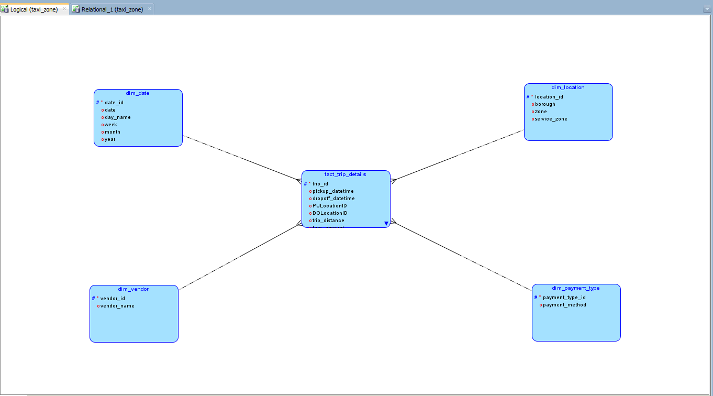
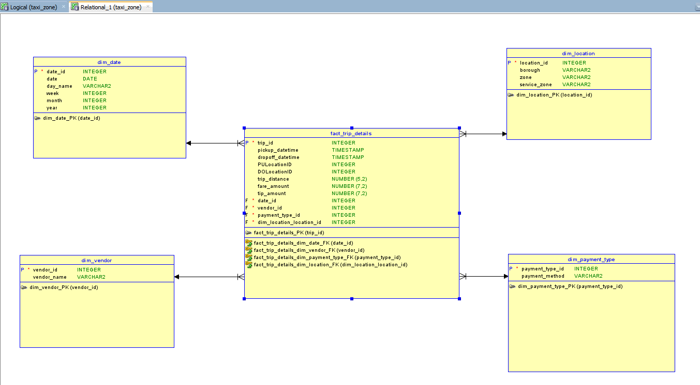

# NYC Yellow Taxi Data Warehouse Project 🚖

This project models the **NYC Yellow Taxi Trip Records** as a Data Warehouse using **PostgreSQL 15**. It follows the **Dimensional Approach (Star Schema)** for analytical queries.

## 📊 Business Requirements
- Analysts need **date-based** reports, such as:
  - Which **days of the week** have the highest and lowest number of trips?
  - Do certain days have **longer/shorter** average trip distances?
  - How do **fare amounts and tip percentages** vary by the day of the week?
- **Fact Table is immutable** (no updates/deletes on old records).
- **Location, Vendor, RateCode, Payment Type may change over time.**

## 📁 Repository Structure
- `dimensional_model.png` → **Conceptual Model (Draw.io)**
- `logical.png` → **Logical Model (Oracle SQL Developer Data Modeler)**
- `relational.png` → **Physical Model (Table Schema)**
- `create_tables.sql` → **PostgreSQL DDL scripts to create tables**
- `data_loading.sql` → **SQL scripts for loading CSV data into tables**

## 📌 Star Schema Model
**Fact Table:**  
- `fact_trip_details` → Stores trip-related metrics (distance, fare, tip, etc.).

**Dimension Tables:**  
- `dim_date` → Contains date attributes.
- `dim_location` → Maps **PULocationID** and **DOLocationID**.
- `dim_vendor` → Stores vendor details.
- `dim_payment_type` → Stores payment methods.

### **Entity-Relationship Diagram (ERD)**

**Logical Model:**  


**Physical Model:**  


---

## 🏗️ PostgreSQL Table Creation (DDL)
```sql
CREATE TABLE dim_date (
    date_id SERIAL PRIMARY KEY,
    date DATE NOT NULL,
    day_name VARCHAR(10),
    week INTEGER,
    month INTEGER,
    year INTEGER
);

CREATE TABLE dim_location (
    location_id INTEGER PRIMARY KEY,
    borough VARCHAR(50),
    zone VARCHAR(100),
    service_zone VARCHAR(50)
);

CREATE TABLE dim_vendor (
    vendor_id SERIAL PRIMARY KEY,
    vendor_name VARCHAR(50)
);

CREATE TABLE dim_payment_type (
    payment_type_id SERIAL PRIMARY KEY,
    payment_method VARCHAR(50)
);

CREATE TABLE fact_trip_details (
    trip_id BIGSERIAL PRIMARY KEY,
    pickup_datetime TIMESTAMP NOT NULL,
    dropoff_datetime TIMESTAMP NOT NULL,
    PULocationID INTEGER NOT NULL REFERENCES dim_location(location_id),
    DOLocationID INTEGER NOT NULL REFERENCES dim_location(location_id),
    trip_distance NUMERIC(5,2),
    fare_amount NUMERIC(7,2),
    tip_amount NUMERIC(7,2),
    payment_type_id INTEGER NOT NULL REFERENCES dim_payment_type(payment_type_id),
    vendor_id INTEGER NOT NULL REFERENCES dim_vendor(vendor_id),
    date_id INTEGER NOT NULL REFERENCES dim_date(date_id)
);
```

## 🚀 Data Loading into PostgreSQL
### **Loading Location Data from `taxi_zone_lookup.csv`**
```sql
COPY dim_location(location_id, borough, zone, service_zone)
FROM '/tmp/taxi_zone_lookup.csv'
DELIMITER ',' CSV HEADER;
```

### **Generating `dim_date` Table Data (Automatic)**
```sql
INSERT INTO dim_date (date, day_name, week, month, year)
SELECT 
    d::date AS date,
    TO_CHAR(d::date, 'Day') AS day_name,
    EXTRACT(WEEK FROM d) AS week,
    EXTRACT(MONTH FROM d) AS month,
    EXTRACT(YEAR FROM d) AS year
FROM generate_series('2023-01-01'::date, '2024-12-31'::date, '1 day'::interval) d;
```

### **Inserting Sample Vendor & Payment Data**
```sql
INSERT INTO dim_vendor (vendor_name) VALUES ('Vendor 1'), ('Vendor 2');
INSERT INTO dim_payment_type (payment_method) VALUES ('Credit Card'), ('Cash'), ('E-Wallet');
```

---

## 📌 Summary
- **Conceptual, Logical & Physical models created.**
- **Star Schema used with `fact_trip_details` and 4 dimensions.**
- **DDL & Data loading scripts provided for PostgreSQL 15.**

